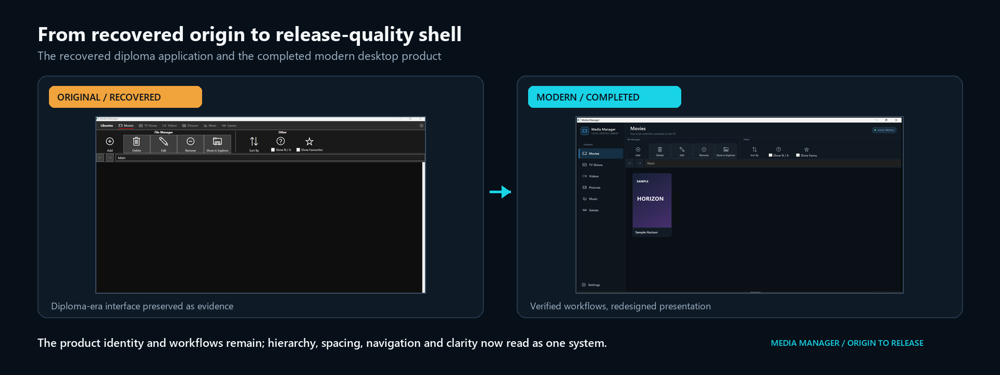
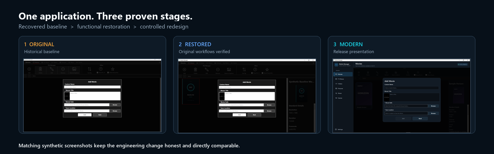
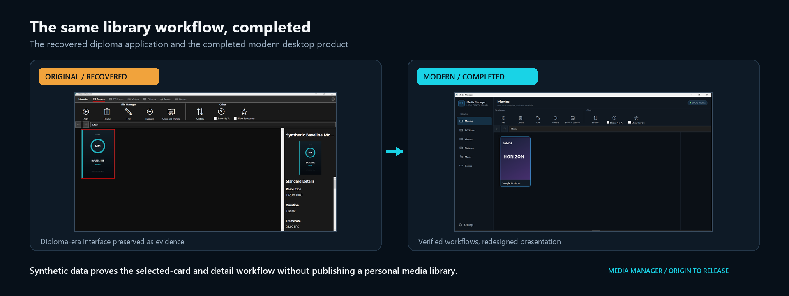
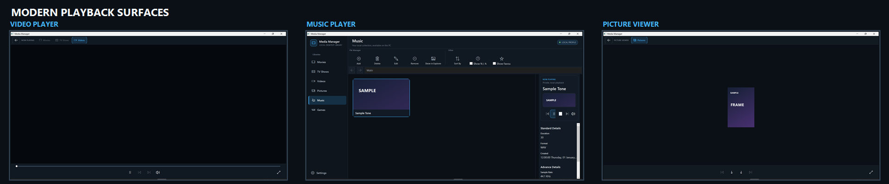

# Media Manager

[](https://github.com/Codie-Shannon/media-manager/actions/workflows/ci.yml)
[](https://github.com/Codie-Shannon/media-manager/releases/latest)

Privacy-first C# WPF media library organiser - restored from my diploma-era origin project and modernized with supported metadata providers.

Media Manager is a local Windows desktop application for organising, enriching, searching, and maintaining personal media libraries. The corrected `v1.0.1` portfolio release preserves the recovered application and its original custom-controls architecture while presenting a verified, modern product.

> **The application that taught me how to build software, completed by the developer it helped me become.**

## Project significance

Media Manager was the first serious application I built during my software-development diploma. It taught me how application structure, WPF, custom controls, file-system workflows, metadata, persistence, debugging, and interface design fit together.

Years later, I recovered the project from a damaged drive. The recovered snapshot preserved substantial real application work, but it was only partially functional and was not a reproducible or release-ready build. I preserved that historical baseline, repaired and reconnected the custom controls library, progressively stabilized its workflows with isolated synthetic data, replaced brittle site scraping with supported provider APIs, strengthened local data handling, and redesigned the interface. This is a modernised origin project, not a greenfield rewrite.

### Historical baseline status

The repository distinguishes three states:

| State | Meaning |
| --- | --- |
| Recovered snapshot | Partially functional historical source recovered from a damaged drive. It demonstrates the original scope and interface, but does not prove every historical workflow or establish the condition of the application when originally submitted. |
| Original-interface functional restoration | A separate, acceptance-complete Student Projects edition based on the pre-modern Group 4 snapshot. It preserves the original interface while carrying the remaining functional corrections and its own complete verification evidence. |
| Modern release | The corrected `v1.0.1` application in this repository: supported providers, reliability work, modern interface, verified player surfaces, packaging, and release evidence. |

The recovered snapshot being incomplete today does not mean the diploma application never worked. It means the damaged-drive recovery could not provide a complete, reproducible copy or full acceptance evidence on its own.

Read the full [original application history](docs/original-application-history.md) and [modernisation case study](docs/modernisation.md).

## Original to modern

[](docs/screenshot-groups/contrast/01-shell-original-to-modern.png)

[](docs/screenshot-groups/contrast/02-add-movie-three-stage.png)

[](docs/screenshot-groups/contrast/03-details-original-to-modern.png)

[](docs/screenshot-groups/contrast/04-modern-playback-surfaces.png)

The evidence is deliberately matched:

| Recovered snapshot | Reproducible build checkpoint | Modern completed release |
| --- | --- | --- |
| [13 original screenshots](docs/screenshot-groups/original) | [13 restored screenshots](docs/screenshot-groups/restored) | [13 modern screenshots](docs/screenshot-groups/modern) |

Every public capture uses generated artwork and synthetic records. The fixed sequences show the same shell, libraries, forms, sorting, provider state, and selected-item details at each stage. Screenshots prove the states pictured; they are not, by themselves, evidence that every workflow passed.

## Core features

- Six local library types: movies, TV shows, videos, pictures, music, and games.
- Folder hierarchies, media cards, selected-item details, search, sorting, filtering, and favourites.
- Add, edit, remove, delete, reveal-in-Explorer, playback, gallery, and game-launch workflows.
- TMDB metadata for movies and television; IGDB metadata for games.
- Manual metadata entry plus no-key, offline, timeout, rate-limit, and stale-cache behavior.
- SQLite persistence with health checks, path-redacted catalog export, verified backups, staged restore, rollback, and corruption recovery.
- Disposable `--demo` profile with generated covers and neutral local fixtures.
- Modern navy/cyan shell with visible focus, accessible names, scroll-safe commands, and responsive long-form layouts.

Media Manager is a desktop organiser. It is not a streaming service, Plex/Kodi replacement, cloud platform, or active IMDb scraper.

## Architecture

| Area | Responsibility |
| --- | --- |
| `src/Media_Manager` | .NET Framework 4.7.2 WPF application, views, local workflows, provider boundary, persistence, recovery, and modern application theme |
| `src/MediaControlsLibrary` | Recovered reusable WPF controls for navigation, cards, details, forms, dialogs, folder browsing, and viewer surfaces |
| `src/MediaControlsTester` | Demonstration harness for the reusable controls; some labels intentionally demonstrate styling without configured destinations |
| `tests/MediaManager.StabilityTests` | Dependency-light x64 regression executable using disposable data and mocked provider responses |
| `sample-data` | Publication-safe fixture policy and generated demo-catalog description |
| `packaging` | Repeatable Release x64 portable-package pipeline and privacy gate |

The recovery intentionally retains a pragmatic hybrid of view code-behind, view models, and static workflow helpers. Provider and data-recovery boundaries were introduced incrementally where they materially improved safety and testability; the project was not rewritten merely to appear newer. See [architecture](docs/architecture.md).

## Metadata providers

`IMetadataProvider` keeps provider response types and authentication out of the UI:

- TMDB: movie, TV, season, and episode search/details, including supported lookup of legacy IMDb external IDs.
- IGDB: game search/details through Twitch application credentials.

Provider calls are cancellable, have bounded timeouts, use timestamped local caches, and always retain a manual-entry route. Credentials are optional, stored outside the repository, and protected for the current Windows user with DPAPI. Setup, failure states, and attribution are documented in [metadata-provider-migration.md](docs/metadata-provider-migration.md).

## Privacy and local-first behavior

Normal use stores the database, settings, encrypted provider configuration, caches, covers, backups, recovery copies, and rolling logs in the current Windows user's local application-data profile. Demo mode instead uses a disposable directory under `%TEMP%` and never opens the normal profile.

The repository and portable package exclude real libraries, databases, API credentials, logs, personal paths, recovered copyrighted samples, caches, and generated build directories. Backups exclude media files and provider credentials; catalog export redacts local path roots. See the complete [privacy model and release audit](docs/privacy.md).

## Build and run

Requirements:

- Windows 10/11 x64;
- Visual Studio 2022 with .NET desktop development;
- .NET Framework 4.7.2 developer pack;
- NuGet package restore.

From a Developer PowerShell:

```powershell
nuget restore MediaManager.sln -ConfigFile NuGet.Config
msbuild MediaManager.sln /t:Rebuild /p:Configuration=Release /p:Platform=x64
src\Media_Manager\bin\x64\Release\Media_Manager.exe --demo
```

The normal executable uses the current user's local profile. Use `--demo` for a completely synthetic portfolio walkthrough.

Build the portable Release:

```powershell
powershell -NoProfile -ExecutionPolicy Bypass -File packaging\build-portable.ps1
```

Run the complete clean release gate:

```powershell
powershell -NoProfile -ExecutionPolicy Bypass -File tools\verify-release.ps1
```

The verifier restores packages, rebuilds and tests Debug/Release x64, creates the portable package, scans for private data and secrets, validates its manifest/ZIP/checksum, and requires a clean Git working tree. GitHub Actions runs the same script. Release contents and verification are documented in [release.md](docs/release.md).

## Testing and evidence

After building each x64 configuration:

```powershell
tests\MediaManager.StabilityTests\bin\x64\Debug\MediaManager.StabilityTests.exe
tests\MediaManager.StabilityTests\bin\x64\Release\MediaManager.StabilityTests.exe
```

The suite covers destructive hierarchy behavior, malformed data, provider mapping and cancellation, encrypted settings, offline fallback, backup/restore, corrupt-database recovery, archive validation, path redaction, demo isolation, and a 2,500-record health scan. Manual matrices verify the complete UI and filesystem workflows. See [testing.md](docs/testing.md), [build-status.md](docs/build-status.md), and the [evidence index](docs/evidence/README.md).

[Watch the silent modern-interface walkthrough](docs/evidence/modern-interface-walkthrough.mp4).

## Release status

`v1.0.1` is the current release. It retains the seven-group recovery and modernisation closure and adds the corrective player pass:

1. preserved recovered baseline;
2. restored reproducible application builds;
3. stabilised original workflows;
4. replaced unsupported scraping with provider APIs;
5. strengthened local data safety and portable release behavior;
6. completed the modern interface;
7. completed packaging, public documentation, visual evidence, privacy/licensing review, and release proof.

The historical `group-2-complete` tag records the point where clean builds and startup were restored. Groups 3–5 were intended to establish the fully functional pre-modern baseline, but a later live audit found that their playback check had verified open/return behavior without detecting the constrained full-window player layout. The defect was corrected and evidenced in `v1.0.1`; the separate original-interface Student Projects edition will receive the same functional correction without the modern theme.

See [release notes](docs/release.md), [changelog](CHANGELOG.md), [closed current bucket](docs/CURRENT_BUCKET.md), and [master plan](docs/MASTER.md).

## Known limitations and possible next steps

- Windows-only .NET Framework 4.7.2 desktop application; no installer or code-signing certificate is provided.
- The recovered architecture still contains substantial code-behind and duplicated view workflow logic.
- File-system changes and database updates are not coordinated as one cross-resource transaction.
- Metadata enrichment requires user-supplied TMDB/IGDB credentials and network access; local use and manual entry do not.
- Provider logos are intentionally not bundled; attribution is textual.
- Future work could include targeted view-service extraction, a supported installer, signed binaries, additional accessibility testing, and opt-in schema cleanup after real migration evidence.

These are transparent next-step opportunities, not blockers hidden behind a completed label.

## Licensing

No reuse license has been selected for the Media Manager source. Copyright remains with Codie Shannon and no permission to copy, modify, or redistribute the project is granted by this repository. Third-party components retain their own licenses. See [licensing.md](docs/licensing.md) and [THIRD-PARTY-NOTICES.md](THIRD-PARTY-NOTICES.md).

## AI-assisted development

AI-assisted development tools were used during restoration, debugging, testing, and documentation. Product direction, architecture, scope, review, validation, and final implementation decisions remained under the author's control.
