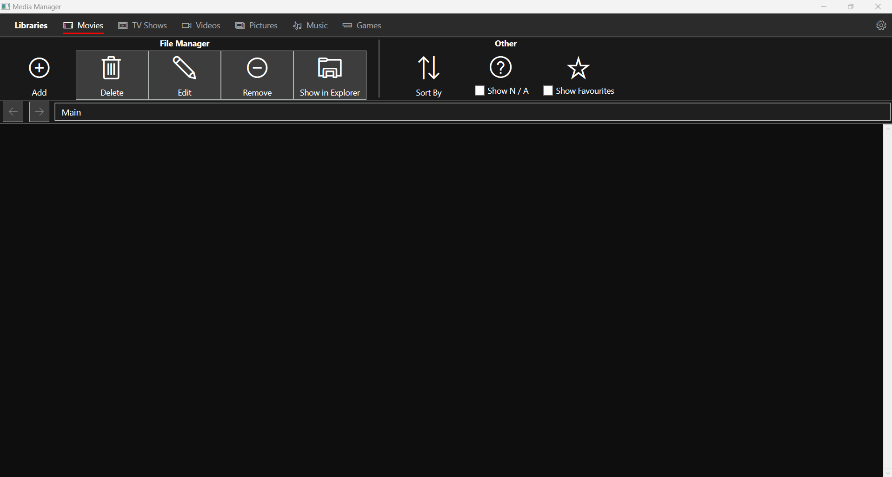
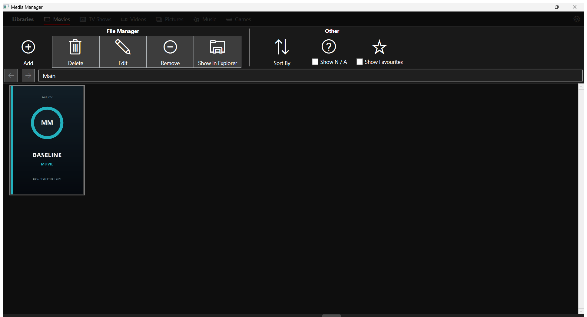
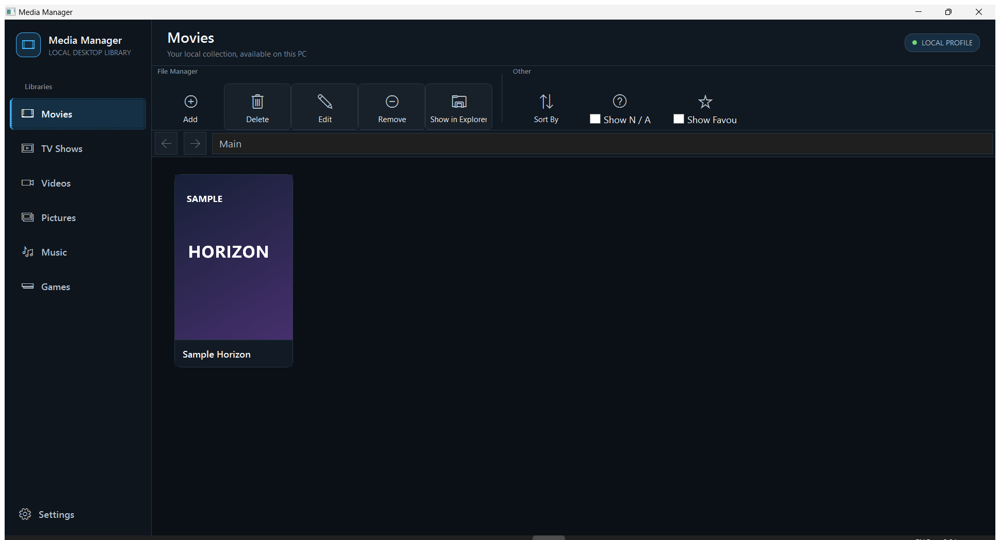

# Media Manager

A privacy-first Windows desktop application for organising, enriching, searching, and maintaining local media libraries.

## Project significance

Media Manager was the first serious application I built during my software-development diploma. It became the project through which I learned many of the foundations I still use today: application structure, WPF, custom controls, file-system workflows, metadata handling, persistence, debugging, and user-interface design.

The modern version restores and completes that origin project rather than replacing its history. Years after its original development, I recovered the project from a damaged drive, repaired its custom controls library, replaced unsupported scraping with a provider-based metadata layer, verified the original workflows, strengthened its local data handling, and redesigned the interface for a modern Windows desktop experience.

> **The application that taught me how to build software, completed by the developer it helped me become.**

## What it does

Media Manager helps users organise and maintain media stored on their own Windows computer. It scans local libraries, displays structured media information, supports search, sorting, filtering, hierarchy, and maintenance workflows, identifies missing or duplicated records, and enriches entries through supported metadata providers.

It manages six local library types:

- movies and TV shows;
- videos and pictures;
- music;
- games.

Media Manager is a local desktop organiser, not a streaming service or media server. Library data, settings, caches, generated covers, backups, and logs remain on the user’s Windows profile.

## Before-and-after engineering case study

| Original diploma version | Restored functional version | Modernised version |
| --- | --- | --- |
| [](docs/screenshot-groups/original) | [](docs/screenshot-groups/restored) | [](docs/screenshot-groups/modern) |
| [View original screenshots](docs/screenshot-groups/original) | [View restored screenshots](docs/screenshot-groups/restored) | [View modern screenshots](docs/screenshot-groups/modern) |

The three fixed 13-image screenshot sets document the same application surfaces at each stage. They make the project’s history, recovery, functional restoration, and controlled redesign visible without using a personal library or copyrighted sample collection.

## Modernisation work

The modernisation preserved the original application’s intent while replacing fragile or outdated implementation details:

- restored and reconnected `MediaControlsLibrary`, the original reusable WPF controls project;
- made Debug and Release builds reproducible from a clean checkout;
- verified and repaired the original media-management, hierarchy, file, playback, and launch workflows;
- replaced IMDb and browser scraping with a supported TMDB/IGDB provider abstraction;
- added cancellation, timeouts, caching, encrypted local provider settings, and offline/manual fallbacks;
- added safer backup, restore, recovery, health-check, logging, and portable-release behavior;
- preserved original and restored screenshots before redesigning the interface;
- redesigned the complete shell, navigation, cards, details, forms, settings, and application states;
- added automated stability coverage, synthetic demo data, release packaging, and portfolio evidence.

## Current status

Group 6 is complete. The origin application now combines supported metadata providers and recoverable local persistence with a cohesive modern desktop interface:

- The full solution restores and builds in Debug x64 and Release x64.
- `Media_Manager` references `MediaControlsLibrary` as a project dependency instead of a stale external DLL.
- A fresh profile creates its LocalAppData database directory and required image directories automatically.
- Startup failures raised after managed startup begins are presented in a dependency-free error window.
- An isolated synthetic profile verifies all six libraries, hierarchy navigation, card details, add/edit/remove/delete flows, Explorer actions, playback surfaces, game launch, and resize behavior.
- Critical TV-show ownership, destructive deletion, folder-browser, missing-path, missing-artwork, invalid-date, and game-launch failures are repaired.
- TMDB supplies movie, TV, season, and episode metadata; IGDB supplies game metadata.
- Search and detail retrieval use `IMetadataProvider`, provider-neutral models, cancellation, timeouts, encrypted local credentials, caching, and stale-cache fallback.
- Manual results remain available without credentials or network access.
- Selenium, Chrome-driver, direct IMDb, and direct Metacritic automation are removed from the active application and its runtime output.
- Existing IMDb references can be resolved through TMDB's supported external-ID endpoint without scraping.
- The SQLite connection path is held in memory; startup no longer rewrites the executable configuration file.
- Existing integer primary keys remain stable, and schema version 1 records the reviewed, compatible format without a destructive migration.
- Settings provides verified backup, restore, path-redacted catalog export, and duplicate/missing-path health checks.
- Daily automatic backups retain the newest seven snapshots. Restore creates a safety backup first and rolls back failed replacements.
- Corrupt databases are preserved under the local `Recovery` directory and restored from the newest valid backup when possible.
- Local rolling logs contain startup, background-task, backup, restore, and recovery failures.
- `Media_Manager.exe --demo` creates a disposable synthetic profile with generated covers and neutral library items.
- A repeatable `MediaManager.StabilityTests` executable protects Group 3-5 behavior, including mocked providers, backup/restore, corruption recovery, path redaction, invalid-backup rejection, and a 2,500-record scan.
- `packaging/build-portable.ps1` rebuilds Release x64 and produces a personal-data-free portable folder, ZIP, and SHA-256 checksum.
- Clean tracked-file checkouts build and launch without inherited `bin`, `obj`, or package output.
- No real media library, user database, credentials, or private paths are included.
- Original and restored screenshot groups are preserved as fixed comparison evidence.
- A modern navy/cyan shell now unifies all six libraries, command surfaces, cards, details, forms, settings, provider configuration, dialogs, empty states, and loading states.
- Reusable UI tokens and controls live in `Media_Manager.Controls` while the recovered control library retains the application workflows.
- Keyboard focus is visible, primary controls have meaningful automation names, command surfaces can scroll at constrained widths, and long forms/settings remain reachable.
- The 13-image modern screenshot group provides exact original/restored/modern comparisons using only synthetic data.

The next milestone is Group 7, packaging, portfolio presentation, licensing review, and project closure.

Read the [original project history](docs/original-application-history.md), [modernisation case study](docs/modernisation.md), [architecture](docs/architecture.md), and [current milestone](docs/CURRENT_GROUP.md) for the full story.

## Repository layout

- `src/Media_Manager` - recovered full application source
- `src/MediaControlsLibrary` - recovered WPF controls library
- `src/MediaControlsTester` - controls demonstration application
- `docs` - restoration plan, architecture notes, evidence, and screenshots
- `tests` - automated stability and future provider/persistence tests
- `sample-data` - generated demo catalog and publication-safe fixture policy
- `packaging` - repeatable portable Release candidate build

## Build prerequisites

- Windows
- Visual Studio 2022 with .NET desktop development
- .NET Framework 4.7.2 developer pack
- NuGet package restore

Open `MediaManager.sln`, restore NuGet packages, and build the `x64` configuration. The complete solution is verified in both Debug and Release.

Run the synthetic demo without accessing a real library:

```powershell
src\Media_Manager\bin\x64\Release\Media_Manager.exe --demo
```

Create the portable Release candidate:

```powershell
powershell -NoProfile -ExecutionPolicy Bypass -File packaging\build-portable.ps1
```

Provider credentials are entered under **Settings > Configure Metadata Providers** and are encrypted for the current Windows user. Environment-variable setup and provider behavior are documented in [docs/metadata-provider-migration.md](docs/metadata-provider-migration.md).

Backup, restore, health-check, catalog-export, and recovery behavior is documented in [docs/data-recovery.md](docs/data-recovery.md).

## Privacy and sample-data policy

The project is designed to operate locally. This repository must not contain:

- real media libraries or databases;
- personal filesystem paths;
- API credentials;
- copyrighted poster, cover, or game-library samples;
- generated `bin`, `obj`, `.vs`, or NuGet package directories.

Only synthetic sample data and publication-safe evidence may be committed.

## License

No license has been selected yet. Dependency and recovered-asset provenance must be reviewed before a license is added.
